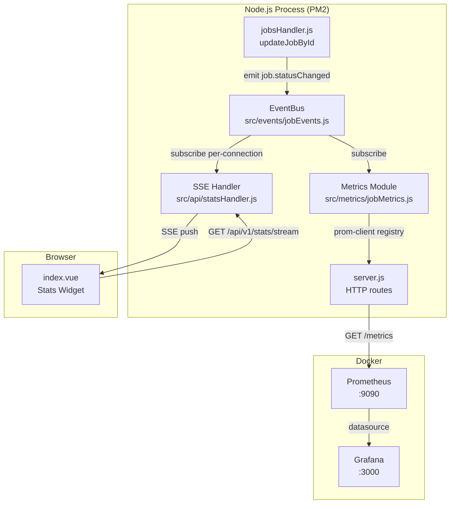

# Design Document: Grafana Monitoring

## Overview

This feature adds Prometheus metrics collection and Grafana dashboards to the RemoteYeah job parser API, plus a real-time SSE stats widget on the frontend. The design centers on an internal EventBus that decouples the job update handler from all observability concerns — metrics, SSE, and any future subscribers attach to the bus without touching handler code.

The existing stack runs Node.js + PM2 on the host. Prometheus and Grafana run in Docker containers using host networking so they can reach the Node.js process at `localhost:4040`.

## Architecture



Data flow for a status update:
1. `PATCH /api/v1/jobs/:id` → `updateJobById` fetches existing job (gets `fromStatus`), updates, emits `job.statusChanged` on EventBus
2. EventBus fans out to two subscribers simultaneously:
   - Metrics Module increments `job_status_transitions_total` counter
   - SSE Handler queries MongoDB for fresh counts, pushes `data:` to all connected clients
3. Prometheus scrapes `/metrics` every 15s; Grafana queries Prometheus

## Components and Interfaces

### EventBus (`src/events/jobEvents.js`)

Singleton `EventEmitter`. Exported once at module load — Node's module cache guarantees singleton behavior.

```js
// exports
module.exports = { eventBus, JOB_STATUS_CHANGED }
// JOB_STATUS_CHANGED = 'job.statusChanged'
```

Event payload shape (`StatusChangedEvent`):
```js
{ jobId: string, fromStatus: string, toStatus: string }
```

### jobsHandler.js — `updateJobById` refactor

Current implementation does a single `findByIdAndUpdate`. The refactor splits it into:
1. `findById` to capture `fromStatus`
2. `findByIdAndUpdate` to apply the new status
3. `eventBus.emit(JOB_STATUS_CHANGED, { jobId, fromStatus, toStatus })`

No import of `prom-client` or any metrics module — the handler only knows about the EventBus.

```js
async function updateJobById(id, body) {
  // validate status ...
  const existing = await JobPage.findById(id).lean();
  if (!existing) return { error: 'not found', code: 404 };
  const fromStatus = existing.status;
  const job = await JobPage.findByIdAndUpdate(id, { status }, { returnDocument: 'after', runValidators: true }).lean();
  eventBus.emit(JOB_STATUS_CHANGED, { jobId: id, fromStatus, toStatus: status });
  return { job };
}
```

### Metrics Module (`src/metrics/jobMetrics.js`)

Initializes prom-client, registers metrics, subscribes to EventBus. Called once from `server.js` at startup.

Metrics registered:
- `job_status_transitions_total` — Counter, labels: `status` (toStatus), `from_status` (fromStatus)
- `job_status_current_total` — Gauge, label: `status`, `collect()` queries MongoDB for live counts

```js
function initMetrics() {
  promClient.collectDefaultMetrics();
  // register counter and gauge
  eventBus.on(JOB_STATUS_CHANGED, ({ fromStatus, toStatus }) => {
    transitionsCounter.inc({ status: toStatus, from_status: fromStatus });
  });
}
module.exports = { initMetrics, register: promClient.register };
```

The gauge uses a `collect` callback so it queries MongoDB on every scrape rather than maintaining stale in-memory state:

```js
new promClient.Gauge({
  name: 'job_status_current_total',
  help: 'Current number of jobs per status',
  labelNames: ['status'],
  async collect() {
    const counts = await JobPage.aggregate([{ $group: { _id: '$status', count: { $sum: 1 } } }]);
    this.reset();
    for (const { _id, count } of counts) this.set({ status: _id }, count);
  }
});
```

### SSE Handler (`src/api/statsHandler.js`)

Manages a `Set` of active response objects. On each new connection:
1. Sets SSE headers, adds `res` to the set
2. Queries MongoDB for initial counts, sends first `data:` message
3. Registers a per-connection listener on EventBus that re-queries and pushes to this client
4. On `req.on('close')`: removes `res` from set, removes the listener

```js
const clients = new Set();

async function handleStatsStream(req, res) {
  res.writeHead(200, {
    'Content-Type': 'text/event-stream',
    'Cache-Control': 'no-cache',
    'Connection': 'keep-alive',
  });
  clients.add(res);
  res.write(`data: ${JSON.stringify(await getCounts())}\n\n`);

  const listener = async () => {
    const counts = await getCounts();
    for (const client of clients) client.write(`data: ${JSON.stringify(counts)}\n\n`);
  };
  eventBus.on(JOB_STATUS_CHANGED, listener);

  req.on('close', () => {
    clients.delete(res);
    eventBus.off(JOB_STATUS_CHANGED, listener);
  });
}
```

`getCounts()` returns an object with all 7 statuses, defaulting missing ones to `0`:

```js
async function getCounts() {
  const STATUSES = ['pending','saved','generated','started','applied','cancelled','error'];
  const rows = await JobPage.aggregate([{ $group: { _id: '$status', count: { $sum: 1 } } }]);
  const map = Object.fromEntries(rows.map(r => [r._id, r.count]));
  return Object.fromEntries(STATUSES.map(s => [s, map[s] ?? 0]));
}
```

### Server (`src/api/server.js`) — additions

Two new routes added to `handleRequest`, plus startup initialization:

```js
const { initMetrics, register } = require('../metrics/jobMetrics');
const { handleStatsStream } = require('./statsHandler');

// In handleRequest:
if (method === 'GET' && pathname === '/metrics') {
  const metrics = await register.metrics();
  res.writeHead(200, { 'Content-Type': register.contentType });
  res.end(metrics);
  return;
}
if (method === 'GET' && pathname === '/api/v1/stats/stream') {
  await handleStatsStream(req, res);
  return;
}

// In main(), before server.listen:
initMetrics();
```

### Frontend Stats Widget (`frontend/pages/index.vue`)

Added above the `.status-filters` section. Uses `EventSource` API, falls back to `statusCounts` computed on error.

> **Migration note**: `updateStatus` and `getCvDownloadUrl` in `index.vue` must be updated to use `/api/v1/jobs/:id` (replacing the current `/api/jobs/:id` paths). The 301 redirects in `routes/jobs.js` provide backward compatibility in the interim.

```vue
<section class="stats-widget" aria-label="Live job counts">
  <button
    v-for="status in STATUSES"
    :key="status"
    class="stats-badge"
    :class="[`status-${status}`, { active: statusFilter === status }]"
    type="button"
    @click="toggleStatusFilter(status)"
  >
    {{ status }} <span class="badge-count">{{ liveStats[status] ?? statusCounts[status] }}</span>
  </button>
</section>
```

Script additions:
```ts
const liveStats = ref<Record<JobStatus, number>>({} as Record<JobStatus, number>);
let statsSource: EventSource | null = null;

onMounted(() => {
  const base = apiBase.value.replace(/\/$/, '') || window.location.origin;
  statsSource = new EventSource(`${base}/api/v1/stats/stream`);
  statsSource.onmessage = (e) => {
    try { Object.assign(liveStats.value, JSON.parse(e.data)); } catch {}
  };
  statsSource.onerror = () => { statsSource?.close(); statsSource = null; };
  // ... existing mount logic
});

onUnmounted(() => {
  statsSource?.close();
  // ... existing unmount logic
});
```

## Data Models

No new MongoDB collections. The existing `JobPage` schema is used read-only by the metrics gauge and SSE handler for aggregation queries.

Prometheus time-series data is stored in the Prometheus container's local TSDB (ephemeral by default, can be made persistent with a volume).

### StatusChangedEvent (in-process only)

```ts
{
  jobId: string;      // MongoDB ObjectId as string
  fromStatus: string; // previous status value
  toStatus: string;   // new status value
}
```

## File Structure

```
src/
  events/
    jobEvents.js          # EventBus singleton + JOB_STATUS_CHANGED constant
  metrics/
    jobMetrics.js         # prom-client setup, counter/gauge, EventBus subscription
  api/
    server.js             # HTTP server bootstrap only: createServer, listen, connectMongo, initMetrics
    router.js             # Central request dispatcher: matches method+pathname, delegates to handlers
    utils.js              # Shared utilities: parseQuery, readBody
    routes/
      jobs.js             # GET /api/v1/jobs, PATCH /api/v1/jobs/:id, GET /api/v1/jobs/:id/cv (+ 301 redirects from legacy /api/jobs/:id paths)
      stats.js            # GET /api/v1/stats/stream (SSE)
      metrics.js          # GET /metrics (Prometheus)
      profiles.js         # GET /api/v1/copy
      static.js           # Static file serving fallback
    statsHandler.js       # SSE endpoint handler, clients Set
    jobsHandler.js        # refactored updateJobById (emit event)
monitoring/
  prometheus.yml          # scrape config targeting localhost:4040
  grafana/
    provisioning/
      datasources/
        ds.yml            # Prometheus datasource pointing to http://prometheus:9090
      dashboards/
        provider.yml      # dashboard provider config
        jobs.json         # pre-built dashboard JSON
docker-compose.yml        # prometheus + grafana services
frontend/
  pages/
    index.vue             # stats widget added above status-filters section
```

## Routing Refactoring

The current `server.js` is a monolithic file with all route handling inline — CORS logic, body parsing, regex matching, and business logic are all interleaved. This section describes how to split it into a proper router structure.

### Target Structure

```
src/api/
  server.js       # HTTP server bootstrap only
  router.js       # Central dispatcher
  utils.js        # Shared utilities
  routes/
    jobs.js       # Job CRUD routes
    stats.js      # SSE stream route
    metrics.js    # Prometheus metrics route
    profiles.js   # Profile copy route
    static.js     # Static file fallback
```

### Design Principles

**`server.js` — bootstrap only**

After refactoring, `server.js` contains only startup concerns: connecting to MongoDB, initializing metrics, and passing the router to `http.createServer`. It no longer contains any route logic.

```js
const { handleRequest } = require('./router');

async function main() {
  await connectMongo();
  initMetrics();
  const server = http.createServer(handleRequest);
  server.listen(PORT, () => console.log(`Server listening on http://localhost:${PORT}`));
}
```

**`router.js` — single entry point**

Exports one function `async handleRequest(req, res)` — the only thing passed to `http.createServer`. Handles CORS headers and OPTIONS preflight before delegating to route handlers. Iterates registered route definitions in order and calls the first match.

```js
const routes = [
  ...require('./routes/jobs'),
  ...require('./routes/stats'),
  ...require('./routes/metrics'),
  ...require('./routes/profiles'),
  ...require('./routes/static'),
];

async function handleRequest(req, res) {
  const url = req.url || '/';
  const pathname = url.split('?')[0];
  const method = req.method;

  // CORS pre-flight interceptor
  cors(res);
  if (method === 'OPTIONS') {
    res.writeHead(204);
    res.end();
    return;
  }

  for (const { method: m, pattern, handler } of routes) {
    if (m !== method && m !== '*') continue;
    const match = typeof pattern === 'string'
      ? (pathname === pattern ? {} : null)
      : pattern.exec(pathname);
    if (match) {
      const params = match.groups ?? (match === {} ? {} : match);
      await handler(req, res, params);
      return;
    }
  }

  res.writeHead(404, { 'Content-Type': 'application/json' });
  res.end(JSON.stringify({ error: 'Not found' }));
}

module.exports = { handleRequest };
```

**Route definition shape**

Each route file exports an array of route definitions:

```js
// { method, pattern, handler }
// pattern: string for exact match, RegExp with named groups for parameterized routes
// handler: async (req, res, params) => void
```

Named capture groups from the RegExp become the `params` object passed to the handler:

```js
// routes/jobs.js
const PATCH_RE    = /^\/api\/v1\/jobs\/(?<id>[a-f0-9A-F]{24})\/?$/;
const CV_RE       = /^\/api\/v1\/jobs\/(?<id>[a-f0-9A-F]{24})\/cv\/?$/;
// Legacy redirects — keep until frontend is updated
const PATCH_RE_LEGACY = /^\/api\/jobs\/(?<id>[a-f0-9A-F]{24})\/?$/;
const CV_RE_LEGACY    = /^\/api\/jobs\/(?<id>[a-f0-9A-F]{24})\/cv\/?$/;

function redirectToV1(req, res, params) {
  const newPath = req.url.replace('/api/jobs/', '/api/v1/jobs/');
  res.writeHead(301, { Location: newPath });
  res.end();
}

module.exports = [
  { method: 'GET',   pattern: '/api/v1/jobs',  handler: handleListJobs },
  { method: 'PATCH', pattern: PATCH_RE,         handler: handlePatchJob },
  { method: 'GET',   pattern: CV_RE,            handler: handleDownloadCv },
  // Backward-compat redirects (301) — remove once frontend uses /api/v1/jobs/:id
  { method: 'PATCH', pattern: PATCH_RE_LEGACY,  handler: redirectToV1 },
  { method: 'GET',   pattern: CV_RE_LEGACY,     handler: redirectToV1 },
];
```

**`utils.js` — shared utilities**

`parseQuery` and `readBody` move out of `server.js` into `src/api/utils.js` and are imported by any route handler that needs them:

```js
// src/api/utils.js
function parseQuery(url) { /* ... */ }
function readBody(req) { /* ... */ }
module.exports = { parseQuery, readBody };
```

**Route files**

| File | Routes | Notes |
|------|--------|-------|
| `routes/jobs.js` | `GET /api/v1/jobs`, `PATCH /api/v1/jobs/:id`, `GET /api/v1/jobs/:id/cv` | Imports `listJobs`, `updateJobById`, `getJobById` from `jobsHandler.js`. Legacy `/api/jobs/:id` paths redirect 301 to `/api/v1/jobs/:id` for backward compatibility until the frontend is updated. |
| `routes/stats.js` | `GET /api/v1/stats/stream` | Delegates to `statsHandler.handleStatsStream` |
| `routes/metrics.js` | `GET /metrics` | Reads from `prom-client` register |
| `routes/profiles.js` | `GET /api/v1/copy` | Returns `LINKEDIN_PROFILE` / `GITHUB_PROFILE` from env |
| `routes/static.js` | `*` (catch-all) | Static file serving, falls back to `index.html` |

`static.js` uses method `'*'` and pattern `/.*/` (or a catch-all) so it is always registered last and acts as the fallback — the router's iteration order guarantees more specific routes match first.

### Migration Notes

- The existing `PATCH_JOBS_RE` and `DOWNLOAD_CV_RE` regexes in `server.js` are replaced by named-group equivalents in `routes/jobs.js`, now targeting `/api/v1/jobs/:id`
- Old `/api/jobs/:id` and `/api/jobs/:id/cv` paths are kept as 301 redirects to their `/api/v1/` equivalents for backward compatibility with the existing frontend — remove these redirect entries once `updateStatus` and `getCvDownloadUrl` in `index.vue` are updated to use `/api/v1/jobs/:id`
- `GET /metrics` stays at `/metrics` (no `/api/v1` prefix) — this is the Prometheus convention and must not change
- CORS logic (`cors(res)` helper) stays in `router.js` as a pre-flight interceptor, not duplicated per route
- No behavior changes — this is a structural refactor only; all existing routes keep their response shapes
- `statsHandler.js` and `jobsHandler.js` are unchanged by this refactor; only their wiring into the server changes

## Docker Compose

```yaml
services:
  prometheus:
    image: prom/prometheus:latest
    network_mode: host
    volumes:
      - ./monitoring/prometheus.yml:/etc/prometheus/prometheus.yml:ro
    restart: unless-stopped

  grafana:
    image: grafana/grafana:latest
    ports:
      - "3000:3000"
    volumes:
      - ./monitoring/grafana/provisioning:/etc/grafana/provisioning:ro
    environment:
      - GF_SECURITY_ADMIN_PASSWORD=admin
    restart: unless-stopped
```

Prometheus uses `network_mode: host` so it can reach `localhost:4040` directly. Grafana uses the service name `prometheus` as its datasource URL (`http://prometheus:9090`) — this works because both containers share the default bridge network for inter-container communication, while Prometheus alone needs host access for scraping.

## Monitoring Configuration

### `monitoring/prometheus.yml`

```yaml
global:
  scrape_interval: 15s

scrape_configs:
  - job_name: remoteyeah_api
    static_configs:
      - targets: ['localhost:4040']
```

### `monitoring/grafana/provisioning/datasources/ds.yml`

```yaml
apiVersion: 1
datasources:
  - name: Prometheus
    type: prometheus
    access: proxy
    url: http://prometheus:9090
    isDefault: true
```

### `monitoring/grafana/provisioning/dashboards/provider.yml`

```yaml
apiVersion: 1
providers:
  - name: default
    type: file
    options:
      path: /etc/grafana/provisioning/dashboards
```

### `monitoring/grafana/provisioning/dashboards/jobs.json`

Pre-built dashboard with two panels:
- Panel 1: Time series — `rate(job_status_transitions_total[5m])` grouped by `status` label, showing transition rate over time
- Panel 2: Stat/bar chart — `job_status_current_total` grouped by `status` label, showing current distribution

## Correctness Properties

*A property is a characteristic or behavior that should hold true across all valid executions of a system — essentially, a formal statement about what the system should do. Properties serve as the bridge between human-readable specifications and machine-verifiable correctness guarantees.*

### Property 1: Status transition counter reflects all emitted events

*For any* sequence of `job.statusChanged` events emitted on the EventBus with arbitrary `(fromStatus, toStatus)` pairs, the `job_status_transitions_total` counter value for each `(status, from_status)` label combination must equal the number of times that pair appeared in the sequence.

**Validates: Requirements 1.3, 3.2**

### Property 2: Gauge reflects actual MongoDB counts

*For any* set of jobs in MongoDB with known status distributions, the `job_status_current_total` gauge values returned by `/metrics` must equal the actual per-status counts in the database.

**Validates: Requirements 1.4**

### Property 3: updateJobById emits correct event payload

*For any* existing job with a known `fromStatus` and any valid `toStatus`, calling `updateJobById` successfully must emit exactly one `job.statusChanged` event whose payload contains the correct `jobId`, `fromStatus`, and `toStatus`. Edge case: if the job does not exist, no event must be emitted.

**Validates: Requirements 2.3, 2.4**

### Property 4: SSE initial snapshot matches MongoDB state

*For any* set of jobs in MongoDB, when a client connects to `/api/v1/stats/stream`, the first `data:` message received must contain counts that match the actual per-status counts in the database, with missing statuses represented as `0`. Edge case: statuses with no jobs must appear with count `0`.

**Validates: Requirements 8.2, 8.7**

### Property 5: SSE push reaches all connected clients on status change

*For any* number of concurrently connected SSE clients, when a `job.statusChanged` event fires, every connected client must receive a `data:` message with the updated counts.

**Validates: Requirements 8.4**

### Property 6: Client disconnect cleans up connection and listener

*For any* set of connected SSE clients, when one client disconnects, the active connections set must shrink by exactly one and the EventBus listener registered for that client must be removed.

**Validates: Requirements 8.6**

### Property 7: Stats widget updates displayed counts on SSE message

*For any* valid JSON payload received via the SSE stream, the Stats Widget must update the displayed count for every status key present in the payload without requiring a page reload.

**Validates: Requirements 9.3**

### Property 8: Stats widget click delegates to toggleStatusFilter

*For any* status badge click in the Stats Widget, the resulting `statusFilter` value must equal the clicked status if it was not already active, or empty string if it was already active — identical to the behavior of the existing `toggleStatusFilter` function.

**Validates: Requirements 9.5**

## Error Handling

- **`updateJobById` — job not found**: returns `{ error: 'not found', code: 404 }`, no event emitted. Existing behavior preserved.
- **`updateJobById` — invalid status**: returns `{ error: 'invalid status', code: 400 }`, no event emitted. Existing behavior preserved.
- **Metrics gauge MongoDB failure**: if the `collect()` callback throws, prom-client will omit the gauge from that scrape. The error is logged but does not crash the server.
- **SSE handler MongoDB failure**: if `getCounts()` throws, the error is caught and logged; the client connection remains open and will receive the next successful push.
- **SSE client disconnect race**: `req.on('close')` removes the client before the next push iteration, preventing writes to closed sockets.
- **Prometheus scrape failure**: Prometheus marks the target `DOWN` and retries on the next 15s interval. No action required from the Node.js side.
- **Frontend EventSource failure**: `onerror` handler closes the connection and sets `statsSource = null`. The widget falls back to `statusCounts` computed from the locally loaded `jobs` array (Requirement 9.7).
- **Frontend EventSource unavailable (SSR)**: `EventSource` is only instantiated inside `onMounted`, which only runs in the browser, so SSR is safe.

## Testing Strategy

### Unit Tests

Focus on specific examples, integration points, and error conditions:

- `jobEvents.js`: assert `require()` twice returns the same reference (singleton); assert `JOB_STATUS_CHANGED === 'job.statusChanged'`
- `jobsHandler.js`: assert no event emitted when job not found; assert event payload matches expected shape on successful update (using a mock EventBus)
- `statsHandler.js`: assert initial snapshot includes all 7 statuses; assert missing statuses default to `0`
- `server.js`: assert `/metrics` returns HTTP 200 with correct `Content-Type`; assert `/api/v1/stats/stream` returns `text/event-stream` header
- Docker/config files: assert `docker-compose.yml` defines both `prometheus` and `grafana` services; assert `prometheus.yml` targets `localhost:4040`

### Property-Based Tests

Use [fast-check](https://github.com/dubzzz/fast-check) (JavaScript PBT library). Each test runs a minimum of 100 iterations.

**Property 1 — Counter reflects all emitted events**
```
// Feature: grafana-monitoring, Property 1: counter reflects all emitted events
fc.assert(fc.asyncProperty(
  fc.array(fc.tuple(fc.constantFrom(...STATUSES), fc.constantFrom(...STATUSES))),
  async (pairs) => {
    // reset registry, emit all pairs, check counter values match pair frequencies
  }
), { numRuns: 100 });
```

**Property 2 — Gauge reflects MongoDB counts**
```
// Feature: grafana-monitoring, Property 2: gauge reflects actual MongoDB counts
fc.assert(fc.asyncProperty(
  fc.array(fc.record({ status: fc.constantFrom(...STATUSES) })),
  async (jobs) => {
    // seed test DB, scrape /metrics, compare gauge values to seeded counts
  }
), { numRuns: 100 });
```

**Property 3 — updateJobById emits correct event payload**
```
// Feature: grafana-monitoring, Property 3: updateJobById emits correct event payload
fc.assert(fc.asyncProperty(
  fc.constantFrom(...STATUSES),  // fromStatus
  fc.constantFrom(...STATUSES),  // toStatus
  async (fromStatus, toStatus) => {
    // create job with fromStatus, call updateJobById, capture emitted event, assert payload
  }
), { numRuns: 100 });
```

**Property 4 — SSE initial snapshot matches MongoDB state**
```
// Feature: grafana-monitoring, Property 4: SSE initial snapshot matches MongoDB state
fc.assert(fc.asyncProperty(
  fc.array(fc.record({ status: fc.constantFrom(...STATUSES) })),
  async (jobs) => {
    // seed DB, connect SSE client, parse first data: message, compare to DB counts
    // assert all 7 statuses present, missing ones = 0
  }
), { numRuns: 100 });
```

**Property 5 — SSE push reaches all connected clients**
```
// Feature: grafana-monitoring, Property 5: SSE push reaches all connected clients
fc.assert(fc.asyncProperty(
  fc.integer({ min: 1, max: 10 }),  // number of clients
  async (clientCount) => {
    // connect N clients, emit job.statusChanged, assert all N received data: message
  }
), { numRuns: 100 });
```

**Property 6 — Client disconnect cleans up**
```
// Feature: grafana-monitoring, Property 6: client disconnect cleans up connection and listener
fc.assert(fc.asyncProperty(
  fc.integer({ min: 1, max: 5 }),  // clients to connect
  fc.integer({ min: 0, max: 4 }),  // index of client to disconnect
  async (count, disconnectIdx) => {
    // connect N clients, disconnect one, assert clients.size === N-1, listener removed
  }
), { numRuns: 100 });
```

**Property 7 — Widget updates on SSE message**
```
// Feature: grafana-monitoring, Property 7: stats widget updates displayed counts on SSE message
fc.assert(fc.property(
  fc.record(Object.fromEntries(STATUSES.map(s => [s, fc.nat()]))),
  (payload) => {
    // mount component with mock EventSource, fire onmessage with payload
    // assert liveStats.value matches payload for all keys
  }
), { numRuns: 100 });
```

**Property 8 — Widget click delegates to toggleStatusFilter**
```
// Feature: grafana-monitoring, Property 8: stats widget click delegates to toggleStatusFilter
fc.assert(fc.property(
  fc.constantFrom(...STATUSES),   // clicked status
  fc.option(fc.constantFrom(...STATUSES)),  // current statusFilter
  (clicked, current) => {
    // simulate click, assert statusFilter === (current === clicked ? '' : clicked)
  }
), { numRuns: 100 });
```

Both unit and property tests run via `node --test` (the existing test runner in `package.json`). Property tests require `npm install --save-dev fast-check`.
